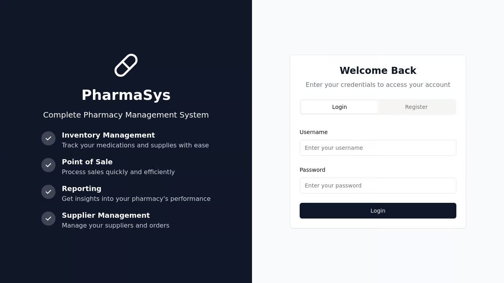
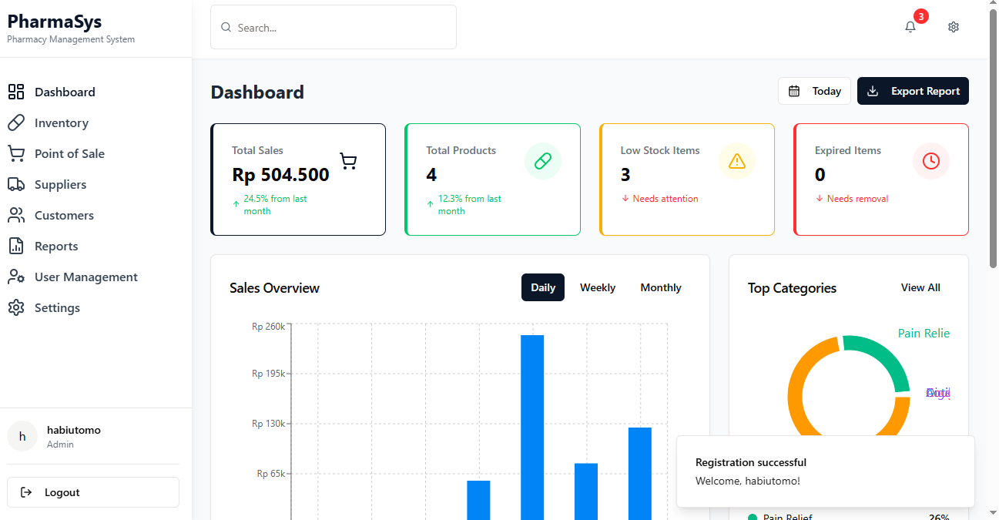

# PharmaSys - Pharmacy Management System

PharmaSys is a comprehensive web-based pharmacy management system designed to streamline inventory control, point of sale operations, supplier management, and business analytics for pharmacy operations.




## Features

### 1. Inventory Management
- Complete medication tracking with detailed product information
- Stock level monitoring with low-stock alerts
- Expiry date tracking
- Categorization of medications
- Stock adjustment history logging

### 2. Point of Sale (POS)
- Fast and intuitive sales interface
- Real-time inventory updates on sale
- Customer integration with loyalty points
- Multiple payment methods (Cash, Card, QR Code)
- Receipt generation and printing options

### 3. Supplier Management
- Comprehensive supplier database
- Contact information and communication tracking
- Order history and relationship management
- Supplier performance metrics

### 4. Customer Management
- Customer profiles with contact information
- Purchase history tracking
- Loyalty/points system
- Personalized service capabilities

### 5. Reporting & Analytics
- Sales performance analysis
- Inventory turnover reporting
- Popular product identification
- Financial performance metrics
- Data visualization with interactive charts

### 6. User Management
- Role-based access control (Admin, Cashier, Inventory Manager)
- User activity tracking
- Secure authentication

## Getting Started

### Prerequisites
- Node.js 20.x or later
- npm or yarn package manager

### Installation
1. Clone the repository
```
git clone https://github.com/yourusername/pharmasys.git
cd pharmasys
```

2. Install dependencies
```
npm install
```

3. Start the development server
```
npm run dev
```

4. Access the application
```
http://localhost:5000
```

### Default Admin Credentials
- Username: admin
- Password: admin123

## System Architecture

PharmaSys is built using the following technologies:
- **Frontend**: React, TailwindCSS, Shadcn UI
- **Backend**: Node.js, Express
- **Database**: In-memory database (can be configured for PostgreSQL)
- **Authentication**: Session-based authentication with Passport.js

## User Roles

### Admin
- Full system access
- User management capabilities
- System configuration

### Cashier
- POS access
- Customer management
- Basic reporting

### Inventory Manager
- Inventory management
- Supplier management
- Stock adjustments

## License

This project is licensed under the MIT License - see the LICENSE file for details.

## Support

For support, please contact [habizinnia@gmail.com](mailto:habizinnia@gmail.com).